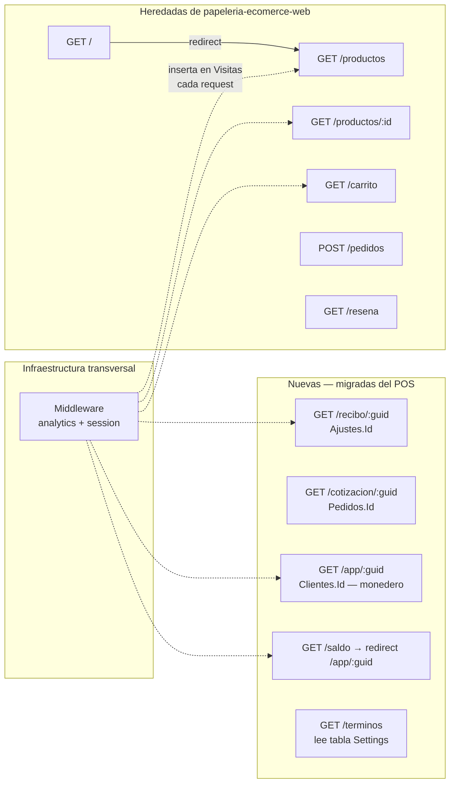

# Plan de Desarrollo — xplaya

Tienda en línea pública — xplaya.com. Rust + Axum + sqlx + Minijinja + HTMX + Alpine.js + Bulma.
Reemplaza `papeleria-ecomerce-web` (Angular) + `papeleria-ecomerce-api` (ASP.NET).

---

## Mapa de rutas



---

## Fundamentos — decidido antes de escribir código

Estas decisiones afectan múltiples fases. Se definen aquí para no tener que refactorizar después.

### Base de datos — tablas nuevas en `inventario_papeleria`

Se crean en Fase 2 (primer contacto con la BD), aunque la feature que las usa llegue después.

```sql
-- Analytics de visitas — se inserta via middleware en Axum (Fase 7)
CREATE TABLE Visitas (
    Id          BIGSERIAL PRIMARY KEY,
    FechaHora   TIMESTAMP NOT NULL DEFAULT NOW(),
    Ruta        VARCHAR(500) NOT NULL,
    Referrer    VARCHAR(500),
    UserAgent   VARCHAR(500),
    SessionId   UUID NOT NULL,
    Ip          VARCHAR(45) NOT NULL
);

-- Acortador de URLs — xplaya redirige, el POS inserta al crear ventas/pedidos
CREATE TABLE ShortUrls (
    Code        VARCHAR(10)  PRIMARY KEY,  -- base62 aleatorio, ej: "xK9mPq"
    Tipo        VARCHAR(20)  NOT NULL,     -- 'recibo' | 'cotizacion' | 'monedero'
    TargetId    UUID         NOT NULL,
    FechaCreado TIMESTAMP    NOT NULL DEFAULT NOW()
);
-- xplaya.com/r/{code} → 301 redirect al destino completo
```

Ambas tablas se crean en Fase 2 (primer contacto con la BD).  
Documentar en `Ro.Inventario.Core/dbscripts/postgresql_inventario.sql`.

**Coordinación con el POS (`inventario_papeleria`)** — trabajo separado, no bloquea xplaya:
- Insertar en `ShortUrls` al crear venta o pedido
- UI del POS: mostrar URL completa, botón "Copiar para cliente" usa la URL corta

### Tracking de sesiones

- `SessionId`: UUID generado por xplaya, guardado en cookie con expiración de 30 minutos.
- Se renueva en cada request si la cookie expiró.
- Sin datos personales — solo identifica la sesión anónima.
- Se implementa como middleware en Axum antes de que llegue al handler de la ruta.

### Deploy

- Imagen ARM64, multi-stage, `ghcr.io/rogithub/xplaya:latest`
- Namespace k3s: `papeleria` (mismo del predecesor)
- NodePort: 30517 (verificar en `k3s-manifests` antes de asignar)
- Secret: `DATABASE_URL` vía SealedSecret
- El `Containerfile` se crea en Fase 1 aunque el deploy formal sea Fase 6

---

## Fase 1 — Servidor base ✓

- [x] `cargo init`, dependencias: Axum, Minijinja, tokio, tower-http
- [x] Estructura: `src/`, `src/db/`, `src/routes/`, `templates/`, `static/`
- [x] Template base con Bulma, HTMX y Alpine.js desde CDN
- [x] Ruta `/` redirige a `/productos` — confirmar que el servidor responde
- [x] `Containerfile` multi-stage ARM64 (construir aunque no se desplegue aún)
- [x] `.env.example` con `DATABASE_URL`

## Fase 2 — Base de datos y catálogo ✓

- [x] Conectar PostgreSQL con sqlx (`DATABASE_URL`)
- [ ] Crear tablas `Visitas` y `ShortUrls` en la BD
- [x] `db/productos.rs` — query paginado de productos
- [x] Ruta `GET /productos` — catálogo con paginación via HTMX
- [x] Ruta `GET /productos/:id` — detalle de producto

## Fase 3 — Carrito de compras ✓

- [x] Carrito en Alpine.js: agregar, quitar, persistir en localStorage
- [x] Badge de items en el header — reactivo con Alpine
- [x] Ruta `GET /carrito` — vista del carrito
- [x] `db/pedidos.rs` — crear cliente por teléfono, crear pedido
- [x] `POST /pedidos` — enviar pedido al servidor

## Fase 4 — Monedero, recibos y URLs cortas ✓

- [x] `db/monedero.rs` — balance y historial de cashback por cliente (`Clientes.Id`)
- [x] `db/settings.rs` — leer valores de tabla `Settings` (para /terminos)
- [x] `db/short_urls.rs` — buscar códigos en `ShortUrls`
- [x] Ruta `GET /recibo/:guid` — ticket de venta (`Ajustes.Id`)
- [x] Ruta `GET /cotizacion/:guid` — cotización/pedido (`Pedidos.Id`)
- [x] Ruta `GET /app/:guid` — monedero del cliente (`Clientes.Id`)
- [x] Ruta `GET /saldo` + `POST /saldo` — form de búsqueda por teléfono → redirect a `/app/:guid`
- [x] Ruta `GET /terminos` — lee `DIAS_VIGENCIA_MONEDERO` y `TIPO_CAMBIO_MONEDERO`
- [x] Ruta `GET /r/:code` — redirect 301 según `Tipo` en `ShortUrls`

## Fase 5 — Reseñas ✓

- [x] Ruta `GET /resena` — página de reseñas

## Fase 6 — Deploy

- [ ] GitHub Actions: build + push imagen a `ghcr.io`
- [ ] Manifiestos k3s en `k3s-manifests/workloads/papeleria/`
- [ ] SealedSecret para `DATABASE_URL`
- [ ] Verificar deploy via ArgoCD

## Fase 7 — Analytics de visitas

- [ ] Middleware Axum que inserta en `Visitas` en cada request
- [ ] Gestión de `SessionId` en cookie (generar, renovar si expiró)
- [ ] Excluir rutas de assets (`/static/*`)
- [ ] Verificar en Superset que los datos llegan

---

> Marcar cada item con `[x]` al completarlo.
